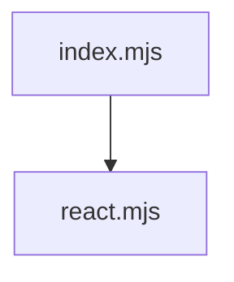
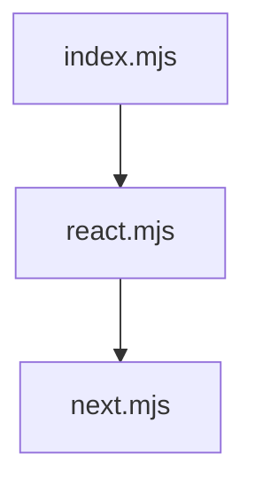
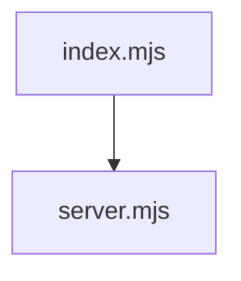
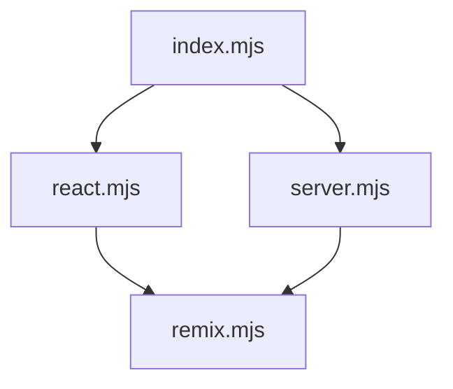

# `@repo/eslint-config`

Collection of internal ESLint configurations for our monorepo, using ESLint 9's flat config system.

## Configurations

### Base (`index.mjs`)

The foundation configuration that all other configs extend from. Provides:

- TypeScript support
- Import ordering
- Basic linting rules
- Prettier integration
- Common ignore patterns
- Base developer experience settings

### React (`react.mjs`)

Extends base config with React-specific rules:



- JSX support
- React Hooks rules
- React best practices
- Component patterns

### Next.js (`next.mjs`)

Extends React config with Next.js specifics:



- Page/App router conventions
- Browser environment
- Next.js file patterns
- Relaxed type boundaries

### Server (`server.mjs`)

Extends base config for server-side packages:



- Node.js environment
- Stricter TypeScript rules
- Test file configurations
- Backend patterns

### Remix (`remix.mjs`)

Extends both server and React configs for fullstack apps:



- Fullstack environment support
- Remix file conventions
- Route patterns
- Mixed client/server rules

## Usage

In your package's `eslint.config.mjs`:

```javascript
// For React libraries
import reactConfig from '@repo/eslint-config/react';
export default [...reactConfig];

// For Next.js apps
import nextConfig from '@repo/eslint-config/next';
export default [...nextConfig];

// For server packages
import serverConfig from '@repo/eslint-config/server';
export default [...serverConfig];

// For Remix apps
import remixConfig from '@repo/eslint-config/remix';
export default [...remixConfig];
```

## Key Features

- ESLint 9 flat config system
- TypeScript-first approach
- Consistent import ordering
- Prettier compatibility
- Monorepo-aware configurations
- Environment-specific rules
- Shared base configuration

## Dependencies

This package manages shared ESLint dependencies for all configurations. Individual projects don't need to install additional ESLint plugins when using these configs.
